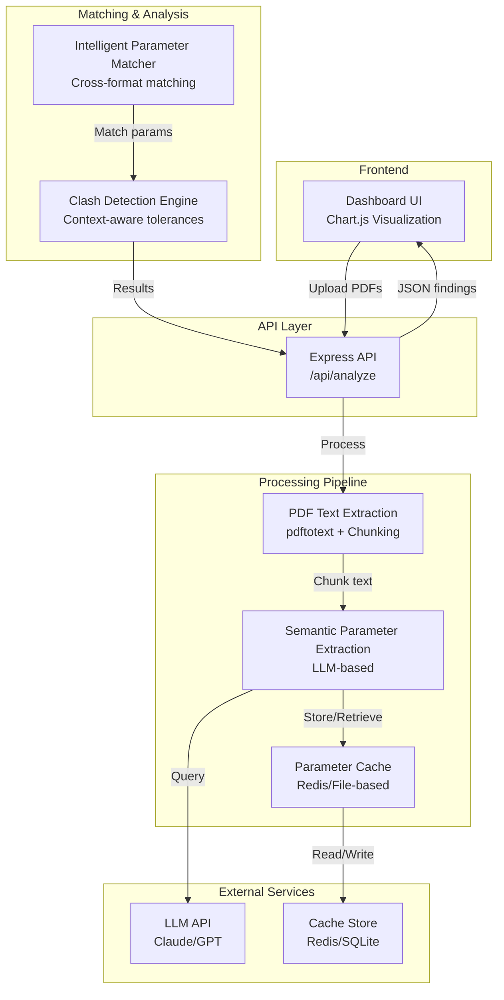

# Design Document: AI-Powered PDF Clash Detection Dashboard Upgrade

## Overview

This design upgrades the existing Spec vs Drawing Clash Detection Dashboard from regex-based extraction to AI-powered semantic extraction. The system will intelligently extract parameters from ANY drawing and specification PDF formats (architectural, structural, MEP, etc.) in multiple languages, match them across different document types, and detect clashes with context-aware tolerance bands. The upgrade maintains backward compatibility with the current API while scaling to handle 100+ page documents efficiently through chunking, caching, and intelligent parameter matching.

## Architecture



## Core Components

### 1. PDF Text Extraction & Chunking

**Purpose**: Extract text from PDFs and intelligently chunk large documents for efficient LLM processing.

**Interface**:
```javascript
interface PDFExtractor {
  extractText(pdfPath: string): Promise<string>
  chunkText(text: string, chunkSize: number, overlap: number): string[]
  extractMetadata(text: string): DocumentMetadata
}

interface DocumentMetadata {
  documentType: 'specification' | 'drawing' | 'unknown'
  pageCount: number
  estimatedSections: string[]
  confidence: number
}
```

**Responsibilities**:
- Use pdftotext with layout preservation for spatial context
- Implement smart chunking: split on section boundaries, maintain context overlap
- Detect document type from content patterns
- Extract metadata (page count, document type indicators)
- Handle English documents (primary language)

**Implementation Notes**:
- Chunk size: 2000-3000 tokens (approximately 1500-2500 words)
- Overlap: 200-300 tokens to maintain context across chunks
- Document type detection: Look for specification keywords ("shall", "minimum", "requirement") vs drawing keywords ("dimension", "detail", "scale")
- Language: English only (no multi-language support needed)

### 2. Semantic Parameter Extraction

**Purpose**: Use Grok LLM to intelligently extract structural parameters from any document format.

**Interface**:
```javascript
interface SemanticExtractor {
  extractParameters(text: string, documentType: string): Promise<Parameter[]>
  extractFromChunks(chunks: string[], context: ExtractionContext): Promise<Parameter[]>
  normalizeParameter(param: RawParameter): Parameter
  validateParameter(param: Parameter): ValidationResult
}

interface Parameter {
  key: string                    // 'bearing_pressure_sls', 'strip_footing', etc.
  label: string                  // Human-readable label
  value: number | string | object // Extracted value
  unit: string                   // 'MPa', 'mm', 'kg/m²', etc.
  confidence: number             // 0-1 confidence score
  source: string                 // 'specification' | 'drawing'
  context: string                // Surrounding text for verification
  extractedAt: Date
  chunkIndex: number             // Which chunk this came from
  metadata: {
    documentType?: string
    section?: string
    pageReference?: string
  }
}

interface ExtractionContext {
  documentType: 'specification' | 'drawing'
  previousParameters?: Parameter[]  // For consistency checking
  knownSections?: string[]
}
```

**Responsibilities**:
- Query Grok LLM with structured prompts to extract parameters
- Handle multiple document types (specs, drawings, MEP plans, etc.)
- Normalize extracted values to standard units
- Assign confidence scores based on extraction clarity
- Maintain consistency across chunks (use previous extractions as context)

**LLM Prompt Strategy**:
```
You are a structural engineering document analyzer. Extract all structural parameters from the provided text.

Document Type: [specification|drawing]

For each parameter found, provide:
1. Parameter key (e.g., bearing_pressure_sls, strip_footing_width)
2. Value and unit
3. Confidence (0-1)
4. Context (surrounding text)

Known parameter types:
- Bearing pressures (SLS/ULS)
- Foundation dimensions (embedment, anchorage)
- Footing types and sizes (strip, isolated, tie beams)
- Loads (permanent, live)
- Material grades (concrete, rebar)
- Dimensions (parapet, slab, floor buildup)
- Levels (FFL, NGF)
- Concrete cover

Return JSON array of extracted parameters.
```

### 3. Parameter Cache

**Purpose**: Avoid re-processing identical or similar documents.

**Interface**:
```javascript
interface ParameterCache {
  get(documentHash: string): Promise<Parameter[] | null>
  set(documentHash: string, parameters: Parameter[]): Promise<void>
  getBySignature(signature: string): Promise<Parameter[] | null>
  invalidate(pattern: string): Promise<void>
  stats(): Promise<CacheStats>
}

interface CacheStats {
  totalEntries: number
  hitRate: number
  averageRetrievalTime: number
  cacheSize: number
}
```

**Responsibilities**:
- Hash PDF content to detect identical documents
- Store extracted parameters with metadata
- Implement TTL (time-to-live) for cache entries
- Support cache invalidation by pattern
- Track cache hit/miss rates for optimization

**Implementation Options**:
- Redis: For distributed systems, fast retrieval
- SQLite: For single-server deployments, persistent storage
- File-based: For development/testing

### 4. Intelligent Parameter Matcher

**Purpose**: Match parameters across different document formats and types.

**Interface**:
```javascript
interface ParameterMatcher {
  matchParameters(specParams: Parameter[], drawingParams: Parameter[]): MatchResult[]
  findSimilarParameters(param: Parameter, candidates: Parameter[]): SimilarityMatch[]
  normalizeForComparison(param: Parameter): NormalizedParam
  computeSimilarity(param1: Parameter, param2: Parameter): number
}

interface MatchResult {
  specParam: Parameter
  drawingParam: Parameter | null
  matchType: 'exact' | 'semantic' | 'partial' | 'missing'
  similarity: number              // 0-1
  matchReason: string
  confidence: number
}

interface SimilarityMatch {
  candidate: Parameter
  similarity: number
  reason: string
}
```

**Responsibilities**:
- Match parameters by key, semantic meaning, and context
- Handle multi-instance parameters (multiple strip footings, loads, etc.)
- Normalize values to common units before comparison
- Compute semantic similarity using parameter context
- Handle missing parameters gracefully
- Support fuzzy matching for similar but not identical parameters

**Matching Strategy**:
1. **Exact Match**: Same key, same normalized value
2. **Semantic Match**: Same parameter type, similar context, within tolerance
3. **Partial Match**: Related parameters (e.g., different footing types)
4. **Missing**: Parameter in spec but not in drawing, or vice versa

**Similarity Computation**:
```
similarity = (keyMatch × 0.3) + (valueMatch × 0.4) + (contextMatch × 0.3)

where:
- keyMatch: 1 if keys match, 0.5 if semantically related, 0 otherwise
- valueMatch: 1 - (abs(val1 - val2) / max(val1, val2)) for numeric values
- contextMatch: Semantic similarity of surrounding text (using embeddings or keyword overlap)
```

### 5. Context-Aware Clash Detection

**Purpose**: Detect clashes with intelligent tolerance bands based on parameter type and context.

**Interface**:
```javascript
interface ClashDetector {
  detectClashes(matches: MatchResult[]): ClashFinding[]
  computeToleranceBand(param: Parameter): ToleranceBand
  classifyClash(match: MatchResult): ClashStatus
  generateSuggestion(finding: ClashFinding): string
}

interface ToleranceBand {
  absolute: number              // Absolute tolerance (e.g., 5 mm)
  relative: number              // Relative tolerance (e.g., 0.02 = 2%)
  marginalMultiplier: number    // Multiplier for warning threshold
  rationale: string             // Why this tolerance was chosen
}

interface ClashFinding {
  key: string
  label: string
  status: 'MATCH' | 'MARGINAL' | 'CLASH' | 'MISSING_IN_DRAWING' | 'MISSING_IN_SPEC'
  specValue: any
  drawingValue: any
  delta: number | null
  toleranceBand: ToleranceBand
  confidence: number
  suggestion: string
  severity: 'critical' | 'warning' | 'info'
  context: {
    specContext: string
    drawingContext: string
  }
}
```

**Responsibilities**:
- Compute context-aware tolerance bands for each parameter type
- Classify clashes based on parameter semantics and domain knowledge
- Generate actionable suggestions for engineers
- Assign severity levels (critical, warning, info)
- Handle dimension objects (footings with width/depth/height)
- Support custom tolerance rules per project

**Tolerance Band Logic**:
```javascript
const TOLERANCE_RULES = {
  bearing_pressure: {
    absolute: 0.005,      // 5 kPa
    relative: 0.02,       // 2%
    marginalMultiplier: 2,
    rationale: "Bearing pressures are critical; small variations can affect foundation design"
  },
  foundation_embedment: {
    absolute: 0.01,       // 10 mm
    relative: 0.02,       // 2%
    marginalMultiplier: 2,
    rationale: "Embedment depth affects frost protection; must be precise"
  },
  strip_footing_width: {
    absolute: 5,          // 5 mm
    relative: 0.02,       // 2%
    marginalMultiplier: 2,
    rationale: "Footing width affects bearing capacity; undersizing is critical"
  },
  slab_thickness: {
    absolute: 5,          // 5 mm
    relative: 0.02,       // 2%
    marginalMultiplier: 2,
    rationale: "Slab thickness affects structural capacity and deflection"
  },
  concrete_cover: {
    absolute: 2,          // 2 mm
    relative: 0.05,       // 5%
    marginalMultiplier: 2,
    rationale: "Cover affects durability; must meet code requirements"
  },
  // ... more rules
}
```

## Data Models

### Parameter Model

```javascript
interface Parameter {
  id: string                     // UUID
  key: string                    // Normalized parameter key
  label: string                  // Human-readable label
  value: number | string | object
  unit: string
  confidence: number             // 0-1
  source: 'specification' | 'drawing'
  context: string                // Surrounding text (100-200 chars)
  extractedAt: Date
  chunkIndex: number
  metadata: {
    documentType?: string
    language?: string
    section?: string
    pageReference?: string
    extractionMethod?: 'regex' | 'llm' | 'hybrid'
  }
}
```

### Analysis Result Model

```javascript
interface AnalysisResult {
  id: string
  createdAt: Date
  files: {
    drawing: {
      name: string
      hash: string
      textLength: number
      language: string
    }
    specification: {
      name: string
      hash: string
      textLength: number
      language: string
    }
  }
  extracted: {
    spec: Parameter[]
    drawing: Parameter[]
  }
  matches: MatchResult[]
  findings: ClashFinding[]
  summary: {
    total: number
    matches: number
    marginal: number
    clashes: number
    missingInDrawing: number
    missingInSpec: number
    compliancePct: number
  }
}
```

## Processing Pipeline

### Step 1: Document Ingestion

```
Input: Drawing PDF + Specification PDF
↓
1. Extract text from both PDFs using pdftotext
2. Detect language and document type
3. Compute content hash for cache lookup
4. Check cache for existing parameters
5. If cache hit: skip to Step 3
6. If cache miss: proceed to Step 2
```

### Step 2: Semantic Extraction

```
Input: PDF text (possibly chunked)
↓
1. Split text into overlapping chunks (2000-3000 tokens)
2. For each chunk:
   a. Query LLM with extraction prompt
   b. Parse JSON response
   c. Normalize values to standard units
   d. Assign confidence scores
   e. Validate parameters
3. Merge parameters from all chunks:
   a. Deduplicate by key and value
   b. Keep highest confidence for duplicates
   c. Use previous chunks as context for consistency
4. Store in cache with TTL
↓
Output: Normalized Parameter[]
```

### Step 3: Parameter Matching

```
Input: Spec Parameters[], Drawing Parameters[]
↓
1. Group parameters by key
2. For each key group:
   a. If only in spec: mark as MISSING_IN_DRAWING
   b. If only in drawing: mark as MISSING_IN_SPEC
   c. If in both:
      - Compute similarity scores
      - Find best matches
      - Classify match type (exact, semantic, partial)
↓
Output: MatchResult[]
```

### Step 4: Clash Detection

```
Input: MatchResult[]
↓
1. For each match:
   a. Compute context-aware tolerance band
   b. Classify clash status (MATCH, MARGINAL, CLASH)
   c. Assign severity level
   d. Generate suggestion
2. Sort findings by severity
3. Compute summary statistics
↓
Output: ClashFinding[], Summary
```

## API Endpoints

### POST /api/analyze

**Request**:
```javascript
{
  drawing: File,           // PDF file
  specification: File,     // PDF file
  options?: {
    useCache: boolean,     // Default: true
    language?: string,     // Override detected language
    customTolerances?: {   // Override default tolerances
    [key: string]: ToleranceBand
  }
  }
}
```

**Response**:
```javascript
{
  meta: {
    drawingFile: string
    specFile: string
    drawingHash: string
    specHash: string
    cacheHit: boolean
    processingTime: number
    analyzedAt: string
  },
  extracted: {
    spec: Parameter[]
    drawing: Parameter[]
  },
  matches: MatchResult[]
  findings: ClashFinding[]
  summary: {
    total: number
    matches: number
    marginal: number
    clashes: number
    missingInDrawing: number
    missingInSpec: number
    compliancePct: number
  }
}
```

### GET /api/cache/stats

**Response**:
```javascript
{
  totalEntries: number
  hitRate: number
  averageRetrievalTime: number
  cacheSize: number
  oldestEntry: string
  newestEntry: string
}
```

### POST /api/cache/invalidate

**Request**:
```javascript
{
  pattern?: string,  // Regex pattern to match document hashes
  all?: boolean      // Clear entire cache
}
```

## Error Handling

### Extraction Errors

| Scenario | Response | Recovery |
|----------|----------|----------|
| PDF corrupted or unreadable | 400 Bad Request | User re-uploads file |
| LLM API timeout | 504 Gateway Timeout | Retry with exponential backoff |
| LLM API rate limit | 429 Too Many Requests | Queue request, retry later |
| Unsupported language | 400 Bad Request | User specifies language manually |
| Extraction confidence too low | 200 OK with warnings | Include low-confidence params with flags |

### Matching Errors

| Scenario | Response | Recovery |
|----------|----------|----------|
| No parameters extracted | 200 OK with empty findings | User reviews document format |
| Ambiguous parameter matches | 200 OK with multiple candidates | Include all candidates in findings |
| Tolerance band computation fails | Use default tolerances | Log warning, continue |

## Testing Strategy

### Unit Testing

**Parameter Extraction**:
- Test LLM prompt generation with various document types
- Test parameter normalization (unit conversion, value parsing)
- Test confidence score assignment
- Test language detection

**Parameter Matching**:
- Test exact matching (same key, same value)
- Test semantic matching (similar context, different format)
- Test multi-instance matching (multiple footings)
- Test missing parameter detection

**Clash Detection**:
- Test tolerance band computation
- Test clash classification (MATCH, MARGINAL, CLASH)
- Test severity assignment
- Test suggestion generation

### Integration Testing

**End-to-End Pipeline**:
- Test with real specification and drawing PDFs
- Test with multi-language documents
- Test with 100+ page specifications
- Test cache hit/miss scenarios
- Test API response format and timing

**Backward Compatibility**:
- Test that existing regex-based extraction still works
- Test that current API contracts are maintained
- Test that dashboard UI displays results correctly

### Property-Based Testing

**Property Test Library**: fast-check (JavaScript)

**Properties to Test**:
1. **Parameter Normalization**: For any parameter with unit conversion, normalized value should be within 0.1% of expected
2. **Similarity Symmetry**: similarity(A, B) should equal similarity(B, A)
3. **Tolerance Band Consistency**: For any parameter type, tolerance band should be positive and reasonable
4. **Clash Classification Monotonicity**: If value difference increases, clash status should not improve
5. **Cache Idempotence**: Extracting same document twice should yield identical parameters

## Performance Considerations

### Scalability

- **Large Documents**: Chunking strategy handles 100+ page specs efficiently
- **Concurrent Requests**: Use async/await and connection pooling for LLM API
- **Cache Efficiency**: Redis for distributed systems, SQLite for single-server
- **Memory Usage**: Stream PDF text extraction to avoid loading entire file in memory

### Cost Optimization

- **LLM API Calls**: Cache results to minimize API calls
- **Batch Processing**: Group similar documents for batch extraction
- **Selective Extraction**: Only extract parameters relevant to current analysis
- **Token Optimization**: Use efficient prompts to minimize token usage

### Latency

- **Typical Processing Time**: 
  - Small spec (10 pages): 5-10 seconds
  - Large spec (100+ pages): 30-60 seconds
  - With cache hit: <1 second
- **Optimization**: Parallel chunk processing, async LLM calls

## Security Considerations

### Data Privacy

- **PDF Content**: Do not store raw PDF content; only store extracted parameters
- **LLM API**: Use secure API keys, rotate regularly
- **Cache**: Encrypt sensitive parameters at rest
- **User Data**: Implement access controls for analysis results

### Input Validation

- **File Upload**: Validate file type (PDF only), size limits (50 MB max)
- **LLM Response**: Validate JSON structure, sanitize extracted values
- **Parameter Values**: Validate ranges (e.g., bearing pressure 0-1 MPa)

### API Security

- **Rate Limiting**: Limit requests per IP/user to prevent abuse
- **Authentication**: Require API key for production deployments
- **CORS**: Configure appropriate CORS headers for frontend

## Dependencies

### External Services

- **LLM API**: Grok (xAI)
- **Cache**: Redis or SQLite
- **PDF Processing**: pdftotext (poppler CLI)

### Node.js Packages

- `express`: Web framework
- `multer`: File upload handling
- `@xai-org/sdk` or similar: Grok API client
- `redis`: Redis client (optional)
- `sqlite3`: SQLite client (optional)
- `crypto`: For document hashing

## Migration Path

### Phase 1: Hybrid Extraction (Backward Compatible)

- Keep existing regex-based extraction
- Add LLM-based extraction in parallel
- Compare results, use LLM when confidence is high
- Gradually increase LLM usage as confidence improves

### Phase 2: LLM-Primary Extraction

- Make LLM extraction the primary method
- Use regex as fallback for low-confidence extractions
- Deprecate regex-only extraction

### Phase 3: Full LLM Adoption

- Remove regex extraction entirely
- Optimize LLM prompts based on real-world usage
- Implement advanced features (multi-language, custom parameters)

## Configuration

### Environment Variables

```
LLM_PROVIDER=grok
LLM_API_KEY=<grok-api-key>
LLM_MODEL=grok-2
CACHE_TYPE=redis|sqlite|file
CACHE_TTL=86400
CHUNK_SIZE=2500
CHUNK_OVERLAP=300
MAX_FILE_SIZE=52428800
ENABLE_HYBRID_EXTRACTION=true
```

### Custom Tolerance Rules

```javascript
// config/tolerances.js
module.exports = {
  bearing_pressure_sls: { abs: 0.005, frac: 0.02, marginalMultiplier: 2 },
  bearing_pressure_uls: { abs: 0.005, frac: 0.02, marginalMultiplier: 2 },
  foundation_embedment_min: { abs: 0.01, frac: 0.02, marginalMultiplier: 2 },
  // ... more rules
}
```

## Correctness Properties

### Property 1: Parameter Extraction Consistency

**Statement**: For any specification document, extracting parameters twice should yield identical results (modulo timestamp).

**Verification**: 
- Extract parameters from same spec twice
- Compare extracted parameters (ignoring timestamps)
- Assert all parameters match exactly

### Property 2: Tolerance Band Validity

**Statement**: For any parameter type, the tolerance band should satisfy: absolute > 0 AND relative > 0 AND marginalMultiplier > 1.

**Verification**:
- For each parameter type in TOLERANCE_RULES
- Assert absolute > 0
- Assert relative > 0
- Assert marginalMultiplier > 1

### Property 3: Clash Classification Monotonicity

**Statement**: If the difference between spec and drawing values increases, the clash status should not improve (CLASH should not become MARGINAL or MATCH).

**Verification**:
- For any parameter with numeric values
- Compute clash status for (spec=100, drawing=95)
- Compute clash status for (spec=100, drawing=90)
- Assert second status is not better than first

### Property 4: Similarity Symmetry

**Statement**: The similarity between two parameters should be symmetric: similarity(A, B) = similarity(B, A).

**Verification**:
- For any two parameters A and B
- Compute similarity(A, B)
- Compute similarity(B, A)
- Assert both values are equal

### Property 5: Cache Idempotence

**Statement**: Extracting parameters from the same document twice should yield identical results from cache.

**Verification**:
- Extract parameters from document D, store in cache
- Extract parameters from document D again
- Assert second extraction returns cached result
- Assert cached result equals first extraction

### Property 6: Parameter Normalization Accuracy

**Statement**: For any parameter with unit conversion, the normalized value should be within 0.1% of the expected value.

**Verification**:
- For parameter with value=100 and unit='cm'
- Normalize to 'mm'
- Assert normalized value = 1000 ± 1 mm

